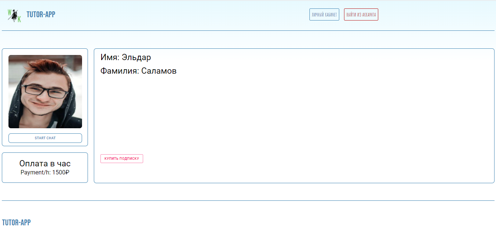
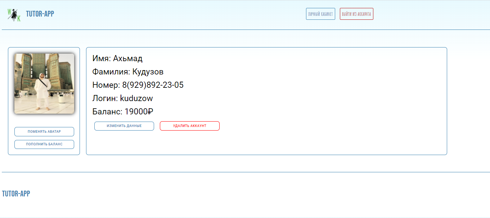

# Приложение разработано для тех кто хочет купить услуги менторов и для тех кто хочет предоставлять услуги менторства.

### Для менторов:

#### Менторы могут зарегистрироваться на сайте указать язык по которому они специализируются установить почасовую оплату.

### Для пользователей:

#### Пользователи могут покупать услуги у менторов. Суть проекта была в том, чтобы пользователь не видел контактные данные ментора пока он не купит у него услугу.

### Основные фичи проекта:

<ul>
    <li><h5>Поиск по сайту</h5></li>
    <li><h5>Чат (должны доделать)</h5></li>
    <li><h5>Регистрация и авторизация</h5></li>
    <li><h5>Показ менторов определенных языков</h5></li>
</ul>

#### Home page

#### Tutors by language page

#### Tutor profile

#### Private page

